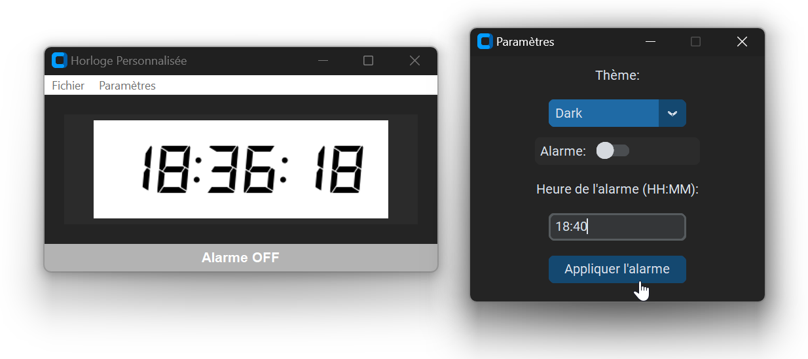

# CustomTkinter-Simple-Digital-Clock

This repository contains a simple digital clock application built using Python and the [CustomTkinter](https://customtkinter.tomschimansky.com/) library.

The clock displays the current time in hours, minutes, and seconds format, and it updates every second.

The application is designed to be user-friendly and visually appealing, with a modern interface.

## Installation

1. Clone the repository: `git clone https://github.com/ArnauldDev/CustomTkinter-Simple-Digital-Clock.git`
2. Create a virtual environment from the project's `src` directory: `python -m venv .env`
3. Activate the virtual environment: `.env\Scripts\activate` (on Windows) or `source .env/bin/activate` (on Linux/macOS)
4. Update `pip`: `python.exe -m pip install --upgrade pip`
5. Install dependencies: `pip install -r requirements.txt`
6. Run the application: `python main.py`

## Usage

1. Activate the virtual environment: `.env\Scripts\activate` (on Windows) or `source .env/bin/activate` (on Linux/macOS)
2. Run the application: `python main.py`

